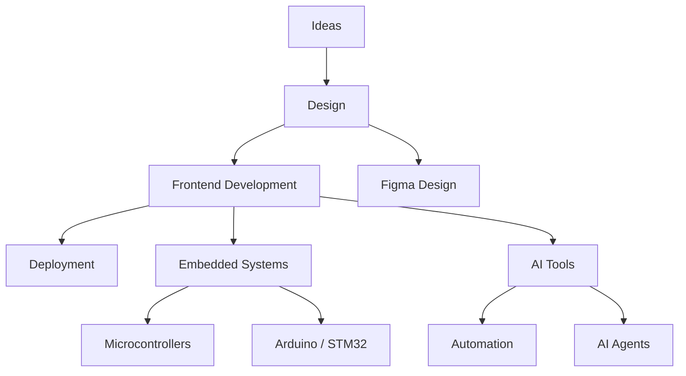

---

## About me

I am an Electronics and Communication Engineering student who enjoys exploring technology by building systems and digital products.

My learning approach is driven by curiosity and experimentation. I strongly believe in the trial-and-error method: building projects, understanding failures, refining ideas, and improving continuously.

My interests span across frontend development, interface design, embedded systems programming, and emerging AI tools.

---

## Areas of Interest

Frontend Engineering
User Interface and Experience Design
Embedded Systems Development
AI-assisted Development Tools
Technology Communities and Collaborative Learning

---

## Technology Stack

### Web Development

HTML
CSS
JavaScript
React
Tailwind CSS
TypeScript

### Programming Languages

Python
C
Embedded C

### Embedded Systems

Microcontroller Programming
Arduino Development
STM32 Development

### Design

Figma
Wireframing
Prototyping
Design Systems

### Tools and Platforms

Git
GitHub
Vercel
Firebase
VS Code
Make

### Embedded Development Tools

Arduino IDE
STM32CubeIDE
Proteus

### Emerging Technologies

AI Tools
AI Agents
Automation Workflows

---

## Developer Journey

My path in technology has evolved through exploration across multiple domains.

### Design

User interface design and prototyping using Figma.

### Web Development

Frontend development using modern frameworks and tools including React, Tailwind CSS, and TypeScript.

### Embedded Systems

Microcontroller programming using Embedded C with development environments such as Arduino IDE and STM32CubeIDE.

### Emerging Technologies

Exploring AI-assisted development tools, automation workflows, and AI agents.

Most learning comes from building projects and refining ideas through experimentation.

---

## Tech Ecosystem

---

## Featured Projects

### Inclusive Language Checker

A web application that analyzes text and suggests inclusive language alternatives.

Live Demo
https://inclusive-checker-b3lh.vercel.app/

---

### Odin Calculator

A functional calculator implementing arithmetic operations and interactive UI logic.

Live Demo
https://odin-calculator-project.vercel.app/

---

### Study Buddy

A simple study assistant tool designed to help students stay organized and focused while learning.

Live Demo
https://study-buddy-swart.vercel.app/

---

## GitHub Activity

---

## Development Statistics

---

## Certification

Responsive Web Design — freeCodeCamp
https://www.freecodecamp.org/certification/AVANTHIKA_K_S/responsive-web-design

---

## Contact

LinkedIn
https://www.linkedin.com/in/avanthika-k-s-1643a0281/

GitHub
https://github.com/AVA-NTHIKA14

Email
[avanthikaks1874@gmail.com](mailto:avanthikaks1874@gmail.com)

---

Learning through building, experimentation, and continuous improvement.

